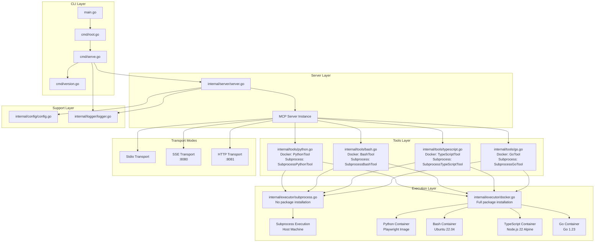

# MCP Executor

An MCP (Model Context Protocol) server that provides multi-language code execution (Python, Bash, TypeScript, and Go) in either subprocess or isolated Docker environments. Built with Go and the Cobra CLI framework, featuring multiple transport modes, flexible execution modes, and built-in Playwright support for web automation.

## Overview

This project implements a robust MCP server that exposes four powerful tools: `execute-python`, `execute-bash`, `execute-typescript`, and `execute-go`. These tools enable execution of code in multiple languages in either:

- **Subprocess mode** (default): Fast execution directly on the host machine
- **Docker mode**: Isolated execution in ephemeral Docker containers

Perfect for data analysis, web scraping, system administration, automation tasks, and multi-language development with the flexibility to choose between speed (subprocess) and isolation (Docker).

## Features

- ⚡ **Dual Execution Modes**: Choose between subprocess (fast) or Docker (isolated) execution
- 🐍 **Python Execution**: Run Python code with pip package installation support
- 🔧 **Bash Execution**: Execute shell commands and scripts
- 📘 **TypeScript Execution**: Run TypeScript code with npm package installation support
- 🔷 **Go Execution**: Run Go code with module support
- 🎭 **Playwright Support**: Built-in browser automation in Docker mode (Python)
- 📦 **Dynamic Package Installation**: Install packages for all languages (Docker mode only)
- 🔄 **Triple Protocol Support**: stdio, SSE (Server-Sent Events), and HTTP transport modes
- 🧹 **Clean Execution**: Subprocess mode or ephemeral Docker containers
- 🛡️ **Flexible Security**: Balance between speed (subprocess) and isolation (Docker)
- 📊 **Verbose Logging**: Optional detailed logging for debugging and monitoring
- 🚀 **CLI Framework**: Built with Cobra for robust command-line interface
- 🧪 **Comprehensive Testing**: Full test coverage with make targets

## Prerequisites

- **Go 1.23.3+**: Required to build and run the server
- **Python 3**: Required for Python subprocess execution (default)
- **Bash**: Required for Bash subprocess execution (usually pre-installed)
- **TypeScript Runtime** (ts-node or tsx): Required for TypeScript subprocess execution
- **Go 1.23+**: Required for Go subprocess execution
- **Docker** (optional): Only required for Docker execution mode (`--execution-mode docker`)
- **Internet Connection**: Required for installing dependencies and pulling Docker images (Docker mode)

## Installation

1. Clone the repository:

   ```bash
   git clone https://github.com/ylchen07/mcp-executor.git
   cd mcp-executor
   ```

2. Install dependencies:

   ```bash
   make deps
   ```

3. Build the project:

   ```bash
   make build
   ```

4. (Optional) Run tests:

   ```bash
   make test
   ```

## Usage

The server supports three transport modes and two execution modes. Use `make help` to see all available commands.

### Default Behavior (Stdio + Subprocess Mode)

Run the MCP server in stdio mode with subprocess execution (fastest, runs on host):

```bash
./bin/mcp-executor
# or
make run
```

### Execution Modes

#### Subprocess Mode (Default - Fast)

Code runs directly on host machine:

```bash
./bin/mcp-executor serve
# or explicitly specify
./bin/mcp-executor serve --execution-mode subprocess
```

#### Docker Mode (Isolated)

Code runs in isolated Docker containers:

```bash
./bin/mcp-executor serve --execution-mode docker
# Short flag
./bin/mcp-executor serve -e docker
```

### Transport Modes

#### SSE Mode

Run the server with HTTP Server-Sent Events support:

```bash
./bin/mcp-executor serve --mode sse
# With Docker execution
./bin/mcp-executor serve --mode sse --execution-mode docker
```

The SSE server will start on `http://localhost:8080`.

#### HTTP Mode

Run the server with streamable HTTP transport:

```bash
./bin/mcp-executor serve --mode http
# With subprocess execution (default)
./bin/mcp-executor serve --mode http --execution-mode subprocess
```

The HTTP server will start on `http://localhost:8081`.

### Combined Options

Combine transport and execution modes with verbose logging:

```bash
# SSE transport + Docker execution + verbose logging
./bin/mcp-executor serve -m sse -e docker -v

# HTTP transport + subprocess execution + verbose
./bin/mcp-executor serve --mode http --execution-mode subprocess --verbose
```

## Tools

The server provides four MCP tools: `execute-python`, `execute-bash`, `execute-typescript`, and `execute-go`. The tool parameters vary based on the execution mode:

### Tool: execute-python

Executes Python code in either subprocess (default) or Docker container based on server's `--execution-mode` setting.

**Execution Mode Differences:**

- **Subprocess Mode**: Uses host's `python3`. **No module installation** allowed for security. Only pre-installed packages and standard library are available.
- **Docker Mode**: Uses Playwright Python image with full pip install support and browser automation capabilities.

### Parameters

**Subprocess Mode:**

| Parameter | Type   | Required | Description                                                         |
| --------- | ------ | -------- | ------------------------------------------------------------------- |
| `code`    | string | Yes      | Python code to execute                                              |
| `env`     | string | No       | Comma-separated KEY=VALUE pairs injected into execution environment |

**Docker Mode:**

| Parameter | Type   | Required | Description                                                         |
| --------- | ------ | -------- | ------------------------------------------------------------------- |
| `code`    | string | Yes      | Python code to execute                                              |
| `modules` | string | No       | Comma-separated list of Python modules to install via pip           |
| `env`     | string | No       | Comma-separated KEY=VALUE pairs injected into execution environment |

### Example Usage

#### Basic Python Execution

```json
{
  "code": "print('Hello, World!')\nprint(2 + 2)"
}
```

#### With Module Installation (Docker Mode Only)

> **Note**: The `modules` parameter is only available in Docker mode. Subprocess mode does not support module installation for security reasons.

```json
{
  "code": "import requests\nresponse = requests.get('https://api.github.com')\nprint(response.status_code)",
  "modules": "requests"
}
```

#### Web Scraping with Playwright (Docker Mode Only)

> **Note**: Playwright browser automation requires Docker mode (`--execution-mode docker`) as it needs the `modules` parameter for installation and the Playwright image includes pre-installed browser binaries.

```json
{
  "code": "from playwright.sync_api import sync_playwright\n\nwith sync_playwright() as p:\n    browser = p.chromium.launch()\n    page = browser.new_page()\n    page.goto('https://example.com')\n    title = page.title()\n    print(f'Page title: {title}')\n    browser.close()",
  "modules": "playwright"
}
```

### Tool: execute-bash

Executes bash scripts in either subprocess (default) or Docker container based on server's `--execution-mode` setting.

**Execution Mode Differences:**

- **Subprocess Mode**: Uses host's `bash`. **No package installation** allowed for security. Only pre-installed system utilities are available.
- **Docker Mode**: Uses Ubuntu 22.04 container with full apt-get package installation support.

#### Parameters

**Subprocess Mode:**

| Parameter | Type   | Required | Description                                                         |
| --------- | ------ | -------- | ------------------------------------------------------------------- |
| `script`  | string | Yes      | Bash script or commands to execute                                  |
| `env`     | string | No       | Comma-separated KEY=VALUE pairs injected into execution environment |

**Docker Mode:**

| Parameter  | Type   | Required | Description                                                         |
| ---------- | ------ | -------- | ------------------------------------------------------------------- |
| `script`   | string | Yes      | Bash script or commands to execute                                  |
| `packages` | string | No       | Comma-separated list of Ubuntu packages to install via apt-get      |
| `env`      | string | No       | Comma-separated KEY=VALUE pairs injected into execution environment |

#### Example Usage

##### Basic Bash Execution

```json
{
  "script": "echo 'Hello, World!'\nls -la"
}
```

##### With Package Installation

> **Note**: Package installation via `packages` parameter only works in Docker mode (`--execution-mode docker`). In subprocess mode, required packages must be pre-installed on the host system.

```json
{
  "script": "curl -s https://api.github.com/repos/octocat/Hello-World | jq '.name'",
  "packages": "curl,jq"
}
```

##### System Information

```json
{
  "script": "echo 'System Info:'\nuname -a\ndf -h\nfree -h",
  "packages": ""
}
```

### Tool: execute-typescript

Executes TypeScript code in either subprocess (default) or Docker container based on server's `--execution-mode` setting.

**Execution Mode Differences:**

- **Subprocess Mode**: Uses host's `ts-node` or `tsx` (auto-detects). **No package installation** allowed for security. Only pre-installed packages and standard library are available.
- **Docker Mode**: Uses Node.js 22 Alpine image with `tsx` runtime and full npm install support.

#### Parameters

**Subprocess Mode:**

| Parameter | Type   | Required | Description                                                         |
| --------- | ------ | -------- | ------------------------------------------------------------------- |
| `code`    | string | Yes      | TypeScript code to execute                                          |
| `env`     | string | No       | Comma-separated KEY=VALUE pairs injected into execution environment |

**Docker Mode:**

| Parameter  | Type   | Required | Description                                                         |
| ---------- | ------ | -------- | ------------------------------------------------------------------- |
| `code`     | string | Yes      | TypeScript code to execute                                          |
| `packages` | string | No       | Comma-separated list of npm packages to install globally            |
| `env`      | string | No       | Comma-separated KEY=VALUE pairs injected into execution environment |

#### Example Usage

##### Basic TypeScript Execution

```json
{
  "code": "console.log('Hello from TypeScript!');\nconst sum = (a: number, b: number) => a + b;\nconsole.log(`2 + 2 = ${sum(2, 2)}`);"
}
```

##### With Package Installation (Docker Mode Only)

> **Note**: The `packages` parameter is only available in Docker mode. Subprocess mode does not support package installation for security reasons.

```json
{
  "code": "import axios from 'axios';\n\nconst response = await axios.get('https://api.github.com');\nconsole.log('Status:', response.status);",
  "packages": "axios"
}
```

##### Async/Await Example

```json
{
  "code": "const delay = (ms: number) => new Promise(resolve => setTimeout(resolve, ms));\n\nconsole.log('Starting...');\nawait delay(1000);\nconsole.log('Done after 1 second!');"
}
```

### Tool: execute-go

Executes Go code in either subprocess (default) or Docker container based on server's `--execution-mode` setting.

**Execution Mode Differences:**

- **Subprocess Mode**: Uses host's `go` compiler with temp file creation. **No package installation** allowed for security. Only standard library and pre-installed packages are available.
- **Docker Mode**: Uses Go 1.23 official image with full `go get` support for external packages.

#### Parameters

**Subprocess Mode:**

| Parameter | Type   | Required | Description                                                         |
| --------- | ------ | -------- | ------------------------------------------------------------------- |
| `code`    | string | Yes      | Go code to execute (must include package main and func main)        |
| `env`     | string | No       | Comma-separated KEY=VALUE pairs injected into execution environment |

**Docker Mode:**

| Parameter  | Type   | Required | Description                                                         |
| ---------- | ------ | -------- | ------------------------------------------------------------------- |
| `code`     | string | Yes      | Go code to execute (must include package main and func main)        |
| `packages` | string | No       | Comma-separated list of Go packages to install via go get           |
| `env`      | string | No       | Comma-separated KEY=VALUE pairs injected into execution environment |

#### Example Usage

##### Basic Go Execution

```json
{
  "code": "package main\n\nimport \"fmt\"\n\nfunc main() {\n\tfmt.Println(\"Hello from Go!\")\n\tsum := 2 + 2\n\tfmt.Printf(\"2 + 2 = %d\\n\", sum)\n}"
}
```

##### With External Packages (Docker Mode Only)

> **Note**: The `packages` parameter is only available in Docker mode. Subprocess mode does not support package installation for security reasons.

```json
{
  "code": "package main\n\nimport (\n\t\"fmt\"\n\t\"github.com/google/uuid\"\n)\n\nfunc main() {\n\tid := uuid.New()\n\tfmt.Printf(\"Generated UUID: %s\\n\", id)\n}",
  "packages": "github.com/google/uuid"
}
```

##### HTTP Request Example

```json
{
  "code": "package main\n\nimport (\n\t\"fmt\"\n\t\"io\"\n\t\"net/http\"\n)\n\nfunc main() {\n\tresp, err := http.Get(\"https://api.github.com\")\n\tif err != nil {\n\t\tfmt.Println(\"Error:\", err)\n\t\treturn\n\t}\n\tdefer resp.Body.Close()\n\tbody, _ := io.ReadAll(resp.Body)\n\tfmt.Printf(\"Status: %d\\nBody length: %d bytes\\n\", resp.StatusCode, len(body))\n}"
}
```

## Prompts

The server provides pre-built prompt templates to guide common tasks. Prompts return formatted messages with ready-to-execute scripts that can be run using the tools above.

**Note**: Prompts are execution-mode aware and only registered when appropriate for the current mode.

### Prompt: system-check

Generates a bash script to gather comprehensive host system information. **Only available in subprocess execution mode** to ensure accurate host system data.

**Description**: Gather comprehensive system information from the host machine including OS details, CPU, memory, disk usage, network interfaces, and running processes.

**Arguments**:

| Argument       | Type   | Required | Description                                                               | Default |
| -------------- | ------ | -------- | ------------------------------------------------------------------------- | ------- |
| `detail_level` | string | No       | Level of detail: `basic`, `detailed`, or `full`. See detail levels below. | `basic` |

**Detail Levels**:

- **`basic`** (default):
  - OS name and version
  - CPU model and core count
  - Memory usage (total/used/free)
  - Root disk usage

- **`detailed`**:
  - Everything in `basic`
  - System uptime and load averages
  - Network interfaces and IP addresses
  - Top 10 processes by memory usage
  - Total process count

- **`full`**:
  - Everything in `detailed`
  - All mounted filesystems
  - Kernel parameters (sample)
  - Logged-in users
  - Environment variables (non-sensitive)

**Example Usage**:

Request the prompt with basic detail level:

```json
{
  "method": "prompts/get",
  "params": {
    "name": "system-check",
    "arguments": {
      "detail_level": "basic"
    }
  }
}
```

The server returns a formatted message with a bash script that you can then execute using the `execute-bash` tool:

```json
{
  "method": "tools/call",
  "params": {
    "name": "execute-bash",
    "arguments": {
      "script": "<generated system check script>"
    }
  }
}
```

**Important Notes**:

- ⚠️ **Subprocess mode only**: This prompt is only registered when running in subprocess mode (`--execution-mode subprocess` or default). It will not appear in Docker mode.
- 🎯 **Host system info**: Designed to gather information about the host machine where the server is running, not container information.
- 🔒 **Security**: Scripts include fallback commands and error handling for missing utilities.

**Example with detailed level**:

```json
{
  "method": "prompts/get",
  "params": {
    "name": "system-check",
    "arguments": {
      "detail_level": "detailed"
    }
  }
}
```

**Example with full level**:

```json
{
  "method": "prompts/get",
  "params": {
    "name": "system-check",
    "arguments": {
      "detail_level": "full"
    }
  }
}
```

**Listing available prompts**:

To see all available prompts for the current execution mode:

```json
{
  "method": "prompts/list"
}
```

In subprocess mode, this will include `system-check`. In Docker mode, the list will be empty (no prompts registered).

## Architecture

The project follows a clean, modular architecture built with the Cobra CLI framework:



### Directory Structure

```
├── main.go                    # Application entry point
├── Makefile                   # Build, test, and development commands
├── .gitignore                 # Git ignore rules
├── cmd/
│   ├── root.go               # Root command and CLI setup
│   ├── serve.go              # Serve command with execution-mode flag
│   └── version.go            # Version command
├── internal/
│   ├── config/
│   │   └── config.go         # Configuration constants
│   ├── executor/
│   │   ├── executor.go       # Executor interface definition
│   │   ├── subprocess.go     # Subprocess executor (default)
│   │   ├── subprocess_test.go # Subprocess executor tests
│   │   └── docker.go         # Docker-based executor (optional)
│   ├── logger/
│   │   └── logger.go         # Logging utilities and verbose output
│   ├── server/
│   │   └── server.go         # MCP server setup with executor injection
│   └── tools/
│       ├── python.go         # Python execution tool implementation
│       ├── bash.go           # Bash execution tool implementation
│       ├── typescript.go     # TypeScript execution tool implementation
│       └── go.go             # Go execution tool implementation
```

### Key Components

- **CLI Framework**: Built using `github.com/spf13/cobra` for robust command-line interface
- **MCP Server**: Built using `github.com/mark3labs/mcp-go` library with multiple transport support
- **Executor Interface**: Abstraction for different execution strategies (subprocess, Docker)
- **Subprocess Executor**: Default executor running code directly on host machine (no package installation)
- **Docker Executor**: Optional executor for isolated container execution (full package installation)
- **Dependency Injection**: Server selects appropriate tools and executors based on `--execution-mode` flag
- **Tool Separation**: Distinct tool implementations for each execution mode:
  - **Docker Tools**: `PythonTool`, `BashTool`, `TypeScriptTool`, and `GoTool` with dependency installation parameters
  - **Subprocess Tools**: `SubprocessPythonTool`, `SubprocessBashTool`, `SubprocessTypeScriptTool`, and `SubprocessGoTool` without installation parameters
- **Logger**: Centralized logging with verbose mode support
- **Configuration**: Centralized constants and settings
- **Makefile**: Comprehensive build, test, and development targets

## Configuration

### Server Configuration (`internal/config/config.go`)

- **Server Name**: `mcp-executor`
- **Server Version**: `1.0.0`
- **Transport Ports**:
  - SSE Port: `:8080` (`http://localhost:8080`)
  - HTTP Port: `:8081` (`http://localhost:8081`)
  - Stdio: Standard input/output (default)

### Execution Modes

#### Subprocess Mode (Default)

- **Python Binary**: `python3`
- **Bash Binary**: `bash`
- **TypeScript Runtime**: `ts-node` or `tsx` (auto-detected)
- **Go Binary**: `go`
- **Package Installation**: ❌ Not supported for any language - pre-installed packages only (security restriction)
- **Environment**: Inherits from host + custom variables
- **Security**: Defense-in-depth prevents package installation at API and execution layers

#### Docker Mode (Optional)

- **Python Image**: `mcr.microsoft.com/playwright/python:v1.53.0-noble`
- **Bash Image**: `ubuntu:22.04`
- **TypeScript Image**: `node:22-alpine`
- **Go Image**: `golang:1.23`
- **Package Installation**: ✅ Full support for all languages in ephemeral containers
  - Python: `pip install`
  - Bash: `apt-get install`
  - TypeScript: `npm install -g`
  - Go: `go get`
- **Environment**: Isolated container environment + custom variables
- **Security**: Full isolation with ephemeral containers removed after each execution

## Development

All development tasks are managed through the Makefile for consistency and ease of use.

### Available Make Targets

```bash
make help              # Show all available commands
make build             # Build the binary to bin/mcp-executor
make test              # Run tests with verbose output (no cache)
make test-coverage     # Run tests with coverage report
make fmt               # Format Go code
make lint              # Run golangci-lint
make deps              # Tidy Go dependencies
make run               # Run the application
make clean             # Remove build artifacts and cache
```

### Building

```bash
make build
```

### Running Tests

```bash
# Run all tests with verbose output
make test

# Generate coverage report
make test-coverage
# Opens coverage/coverage.html
```

### Code Quality

```bash
# Format code
make fmt

# Run linter
make lint

# Manage dependencies
make deps
```

## Security Considerations

### Subprocess Mode (Default)

⚠️ **Security Warning**: Code runs directly on the host machine with user permissions

- **No Isolation**: Code has access to the host filesystem and environment
- **User Permissions**: Runs with the same permissions as the server process
- **No Package Installation**: Defense-in-depth security prevents both pip and apt-get installations:
  - Tool schema omits `modules` and `packages` parameters (API-level protection)
  - Executor enforces `InstallCmd: nil` (execution-level protection)
  - Only pre-installed packages and standard libraries are available
- **Recommendation**: Only use for trusted code or development environments

### Docker Mode

✅ **Enhanced Security**: Full container isolation

- **Isolated Execution**: Code runs in ephemeral Docker containers
- **No Persistence**: Containers are removed after each execution (`--rm` flag)
- **Default Networking**: Containers run with Docker's default bridge network
- **Ephemeral State**: No data persists between executions
- **Recommendation**: Use for untrusted code or production deployments

### Choosing the Right Mode

| Use Case            | Recommended Mode | Reason                             |
| ------------------- | ---------------- | ---------------------------------- |
| Development/Testing | Subprocess       | Faster execution, easier debugging |
| Trusted Scripts     | Subprocess       | No Docker overhead                 |
| Untrusted Code      | Docker           | Full isolation required            |
| Production          | Docker           | Enhanced security and consistency  |
| CI/CD Pipelines     | Either           | Depends on trust level             |

## Dependencies

- `github.com/mark3labs/mcp-go v0.32.0` - MCP protocol implementation
- `github.com/spf13/cobra v1.9.1` - CLI framework
- `github.com/google/uuid v1.6.0` - UUID generation (indirect dependency)
- `github.com/spf13/cast v1.9.2` - Type conversion utilities (indirect)
- `github.com/spf13/pflag v1.0.6` - Command-line flag parsing (indirect)

## Docker Images (Docker Mode Only)

When using `--execution-mode docker`, the following Docker images are used:

**Python Execution:**

- **Image**: `mcr.microsoft.com/playwright/python:v1.53.0-noble`
- **Includes**: Python 3.x, Playwright, and common browser binaries
- **OS**: Ubuntu Noble (24.04 LTS)
- **Use Case**: Web scraping, browser automation, complex Python tasks

**Bash Execution:**

- **Image**: `ubuntu:22.04`
- **Includes**: Standard Ubuntu utilities and package manager
- **OS**: Ubuntu 22.04 LTS
- **Use Case**: System administration, package installation, isolated bash scripts

**TypeScript Execution:**

- **Image**: `node:22-alpine`
- **Includes**: Node.js 22.x, npm, and tsx runtime (pre-installed)
- **OS**: Alpine Linux (minimal)
- **Use Case**: TypeScript execution, npm package usage, async/await operations

**Go Execution:**

- **Image**: `golang:1.23`
- **Includes**: Go 1.23 compiler and standard library
- **OS**: Debian-based
- **Use Case**: Go code execution, standard library usage, external package installation

## Limitations

### Subprocess Mode

- **No Isolation**: Code runs on host with full filesystem access
- **No Package Installation**: Cannot install pip modules or system packages for security
  - Prevents arbitrary code execution via package installation
  - Enforced at both API (no `modules`/`packages` parameters) and execution layers
- **Limited to Pre-installed**: Only standard libraries and pre-installed packages available
- **Security Risk**: Untrusted code can potentially harm the host system

### Docker Mode

- **Docker Dependency**: Requires Docker to be running
- **Slower Performance**: Container startup overhead compared to subprocess
- **Image Size**: Large Docker images (Playwright image is ~1.5GB)
- **Resource Limits**: Subject to Docker container resource constraints

### Both Modes

- **Output Only**: Only stdout/stderr is returned; file system changes are not accessible
- **No State Persistence**: Variables don't persist between executions (except pip packages in subprocess mode)
- **Single Execution**: Each tool call is independent and isolated

## Contributing

1. Fork the repository
2. Create a feature branch
3. Make your changes
4. Add tests if applicable
5. Submit a pull request

## License

This project is licensed under the MIT License - see the [LICENSE](LICENSE) file for details.

## Support

For issues and questions, please refer to the project's issue tracker or documentation.
