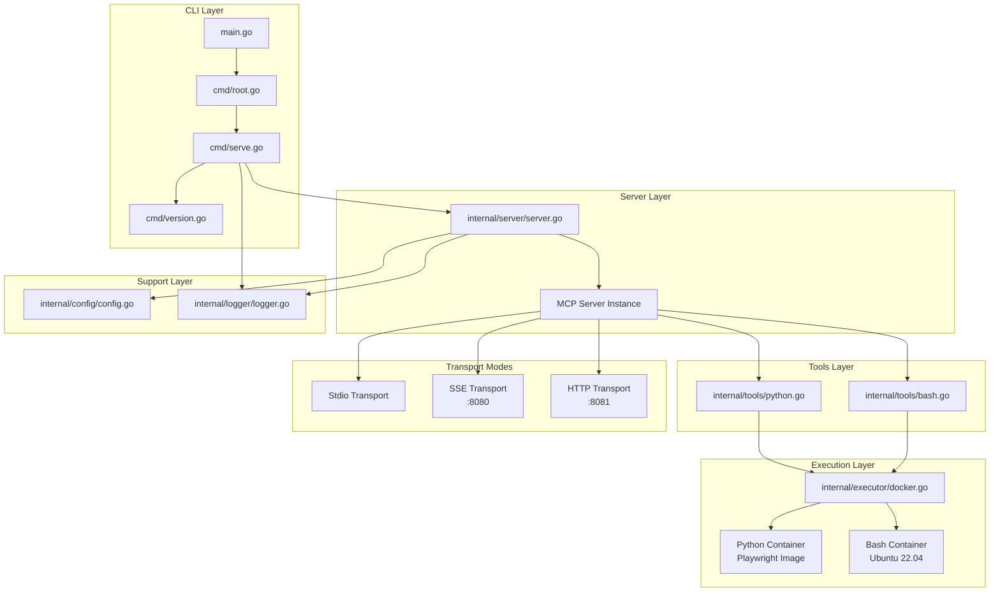

# MCP Executor

An MCP (Model Context Protocol) server that provides secure Python and Bash execution in isolated Docker containers. Built with Go and the Cobra CLI framework, featuring multiple transport modes and built-in Playwright support for web automation.

## Overview

This project implements a robust MCP server that exposes two powerful tools: `execute-python` and `execute-bash`. These tools enable safe execution of Python code and bash scripts in ephemeral Docker containers, making it ideal for data analysis, web scraping, system administration, and automation tasks.

## Features

- 🐍 **Secure Python Execution**: Run Python code in isolated Docker containers
- 🔧 **Secure Bash Execution**: Execute shell commands and scripts in isolated Linux containers
- 🎭 **Playwright Support**: Built-in browser automation and web scraping capabilities
- 📦 **Dynamic Package Installation**: Install Python modules and Ubuntu packages on-the-fly
- 🔄 **Triple Protocol Support**: stdio, SSE (Server-Sent Events), and HTTP transport modes
- 🧹 **Ephemeral Environment**: Each execution starts with a clean container
- 🛡️ **Isolated Execution**: No persistence between runs for enhanced security
- 📊 **Verbose Logging**: Optional detailed logging for debugging and monitoring
- 🚀 **CLI Framework**: Built with Cobra for robust command-line interface

## Prerequisites

- **Go 1.23.3+**: Required to build and run the server
- **Docker**: Must be installed and running for Python code execution
- **Internet Connection**: Required for pulling Docker images and installing Python modules

## Installation

1. Clone the repository:

   ```bash
   git clone https://github.com/ylchen07/mcp-executor.git
   cd mcp-executor
   ```

2. Install dependencies:

   ```bash
   go mod tidy
   ```

3. Build the project:

   ```bash
   go build
   ```

## Usage

The server supports three transport modes and provides a clean CLI interface:

### Default Behavior (Stdio Mode)

Run the MCP server in stdio mode for direct integration with MCP clients:

```bash
./mcp-executor
# or
go run main.go
```

### SSE Mode

Run the server with HTTP Server-Sent Events support:

```bash
./mcp-executor serve --mode sse
# or
go run main.go serve --mode sse
```

The SSE server will start on `http://localhost:8080`.

### HTTP Mode

Run the server with streamable HTTP transport:

```bash
./mcp-executor serve --mode http
# or
go run main.go serve --mode http
```

The HTTP server will start on `http://localhost:8081`.

### Verbose Output

Enable detailed logging for debugging:

```bash
./mcp-executor serve --verbose
# or
./mcp-executor serve -v --mode sse
```

## Tools

The server provides two MCP tools:

### Tool: execute-python

### Parameters

| Parameter | Type   | Required | Description                                                 |
| --------- | ------ | -------- | ----------------------------------------------------------- |
| `code`    | string | Yes      | Python code to execute                                      |
| `modules` | string | No       | Comma-separated list of Python modules to install           |
| `env`     | string | No       | Comma-separated KEY=VALUE pairs injected into the container |

### Example Usage

#### Basic Python Execution

```json
{
  "code": "print('Hello, World!')\nprint(2 + 2)"
}
```

#### With Module Installation

```json
{
  "code": "import requests\nresponse = requests.get('https://api.github.com')\nprint(response.status_code)",
  "modules": "requests"
}
```

#### Web Scraping with Playwright

```json
{
  "code": "from playwright.sync_api import sync_playwright\n\nwith sync_playwright() as p:\n    browser = p.chromium.launch()\n    page = browser.new_page()\n    page.goto('https://example.com')\n    title = page.title()\n    print(f'Page title: {title}')\n    browser.close()",
  "modules": "playwright"
}
```

### Tool: execute-bash

#### Parameters

| Parameter  | Type   | Required | Description                                             |
| ---------- | ------ | -------- | ------------------------------------------------------- |
| `script`   | string | Yes      | Bash script or commands to execute                      |
| `packages` | string | No       | Comma-separated list of Ubuntu packages to install      |
| `env`      | string | No       | Comma-separated KEY=VALUE pairs available to the script |

#### Example Usage

##### Basic Bash Execution

```json
{
  "script": "echo 'Hello, World!'\nls -la"
}
```

##### With Package Installation

```json
{
  "script": "curl -s https://api.github.com/repos/octocat/Hello-World | jq '.name'",
  "packages": "curl,jq"
}
```

##### System Information

```json
{
  "script": "echo 'System Info:'\nuname -a\ndf -h\nfree -h",
  "packages": ""
}
```

## Architecture

The project follows a clean, modular architecture built with the Cobra CLI framework:



### Directory Structure

```
├── main.go                    # Application entry point
├── cmd/
│   ├── root.go               # Root command and CLI setup
│   ├── serve.go              # Serve command implementation
│   └── version.go            # Version command
├── internal/
│   ├── config/
│   │   └── config.go         # Configuration constants
│   ├── executor/
│   │   ├── executor.go       # Executor interface definition
│   │   └── docker.go         # Docker-based executor implementation
│   ├── logger/
│   │   └── logger.go         # Logging utilities and verbose output
│   ├── server/
│   │   └── server.go         # MCP server setup and transport runners
│   └── tools/
│       ├── python.go         # Python execution tool implementation
│       └── bash.go           # Bash execution tool implementation
```

### Key Components

- **CLI Framework**: Built using `github.com/spf13/cobra` for robust command-line interface
- **MCP Server**: Built using `github.com/mark3labs/mcp-go` library with multiple transport support
- **Docker Executor**: Handles Python and Bash execution in isolated containers
- **Python Tool**: MCP tool implementation for Python code execution with Playwright support
- **Bash Tool**: MCP tool implementation for bash script execution in Ubuntu containers
- **Logger**: Centralized logging with verbose mode support
- **Configuration**: Centralized constants and settings for all transport modes

## Configuration

Current configuration (in `internal/config/config.go`):

- **Server Name**: `mcp-executor`
- **Server Version**: `1.0.0`
- **Docker Images**:
  - Python: `mcr.microsoft.com/playwright/python:v1.53.0-noble`
  - Bash: `ubuntu:22.04`
- **Transport Ports**:
  - SSE Port: `:8080` (`http://localhost:8080`)
  - HTTP Port: `:8081` (`http://localhost:8081`)
  - Stdio: Standard input/output (default)

## Development

### Building

```bash
go build
```

### Running Tests

```bash
go test ./...
```

### Module Management

```bash
go mod tidy
```

## Security Considerations

- **Isolated Execution**: All Python and Bash code runs in separate Docker containers
- **No Persistence**: Containers are removed after each execution (`--rm` flag)
- **Default Networking**: Containers run with Docker's default bridge network; add restrictions when deploying in hardened environments
- **Ephemeral State**: No data persists between executions

## Dependencies

- `github.com/mark3labs/mcp-go v0.32.0` - MCP protocol implementation
- `github.com/spf13/cobra v1.9.1` - CLI framework
- `github.com/google/uuid v1.6.0` - UUID generation (indirect dependency)
- `github.com/spf13/cast v1.9.2` - Type conversion utilities (indirect)
- `github.com/spf13/pflag v1.0.6` - Command-line flag parsing (indirect)

## Docker Image

Uses two Docker images for different execution environments:

**Python Execution:**

- **Image**: `mcr.microsoft.com/playwright/python:v1.53.0-noble`
- **Includes**: Python 3.x, Playwright, and common browser binaries
- **OS**: Ubuntu Noble (24.04 LTS)

**Bash Execution:**

- **Image**: `ubuntu:22.04`
- **Includes**: Standard Ubuntu utilities and package manager
- **OS**: Ubuntu 22.04 LTS

## Limitations

- **No State Persistence**: Variables and installed modules don't persist between executions
- **Docker Dependency**: Requires Docker to be running
- **Output Only**: Only stdout/stderr is returned; file system changes are not accessible
- **Resource Limits**: Subject to Docker container resource constraints

## Contributing

1. Fork the repository
2. Create a feature branch
3. Make your changes
4. Add tests if applicable
5. Submit a pull request

## License

This project is licensed under the MIT License - see the [LICENSE](LICENSE) file for details.

## Support

For issues and questions, please refer to the project's issue tracker or documentation.
